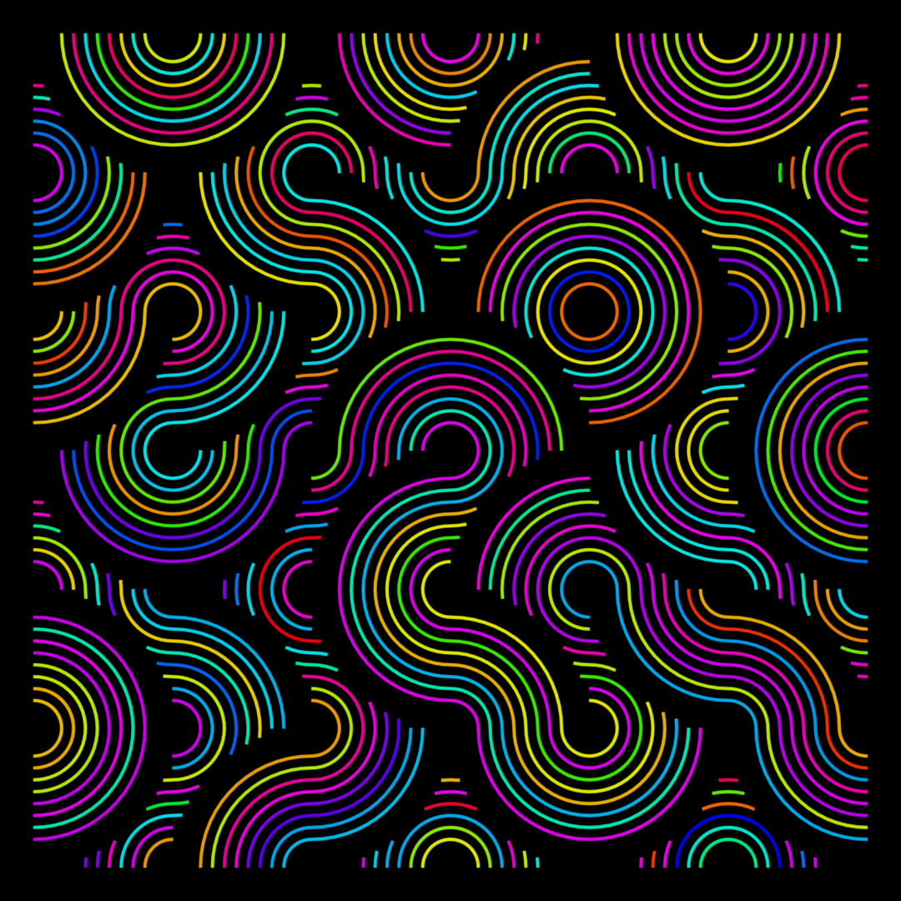
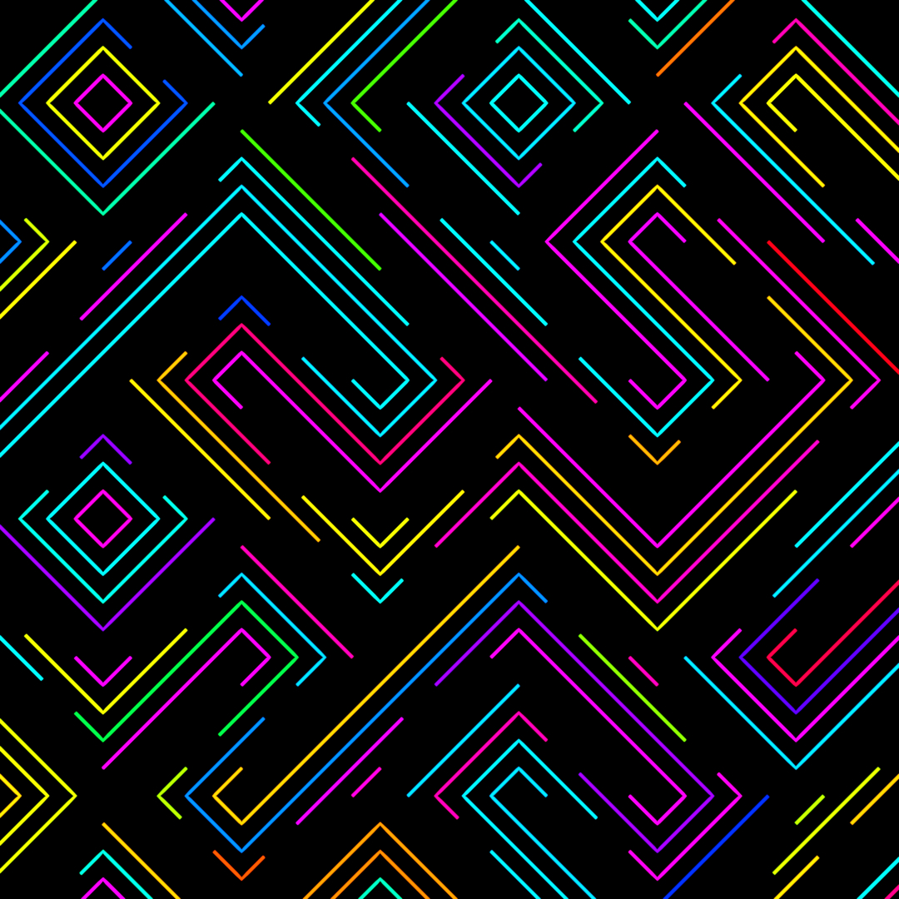
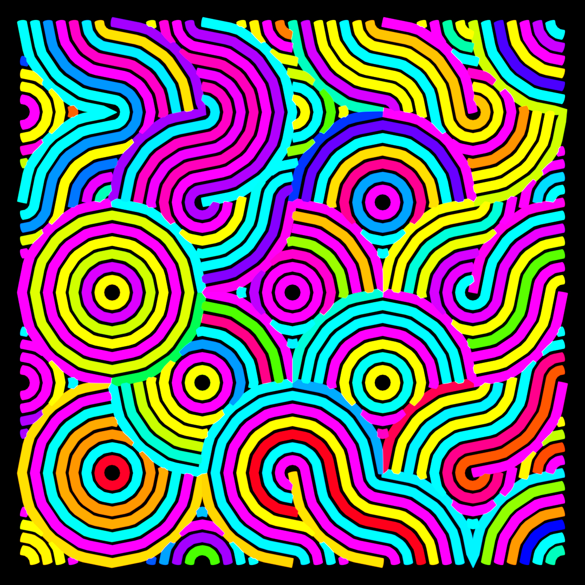

# Beautiful-Pattern-Curves-Blender

This Blender addon utilizes the power of Geometry Nodes to generate beautiful and intricate circular planar patterns. Create stunning backgrounds, textures, and designs with ease.

**Features:**

* **Easy-to-use interface:** Generate complex patterns with just a few clicks.
* **Highly customizable:** Control radius, count, spacing, and more to achieve your desired look.
* **Diverse pattern styles:**  From simple geometric arrangements to flowing, organic designs. 
* **Non-destructive workflow:** Experiment freely with different parameters using the power of Geometry Nodes.
* **Versatile:** Utilize patterns for various applications like backgrounds, textures, or even 3D model embellishments.

**Installation:**

1. Download the addon zip file.
2. Extract the file and the use file creating_curves.zip and material.zip as add-on zips
3. In Blender, go to Edit > Preferences > Add-ons.
4. Click "Install..." and select the downloaded zip file.
5. Enable the addon by checking the checkbox next to its name.

**Usage:**

1. Open Geometry node
2. With Add (Shift + A) add Beautiful Pattern Curves
3. Add material by installing the materials and then applying the material
4. Render or export your scene to see the results.

**Examples:**
## Example 1

## Example 2

## Example 3

**Contributions:**

Contributions are welcome! Please submit pull requests for bug fixes, feature enhancements, or documentation improvements.
